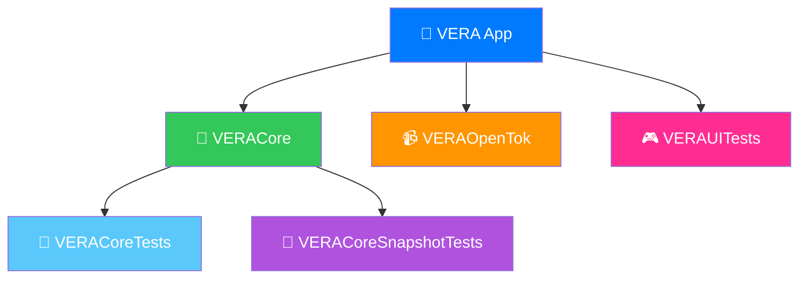

<div align="center">

# 📹 Vonage Video iOS App

*Modern Swift iOS reference application for Vonage Video API*

[](https://github.com/Vonage/vonage-video-ios-app/actions/workflows/ci.yml)
[](https://github.com/Vonage/vonage-video-ios-app/actions/workflows/ui-tests.yml)
[](https://sonarcloud.io/summary/new_code?id=Vonage_vonage-video-ios-app)

[](https://swift.org)
[](https://developer.apple.com/ios/)
[](https://developer.apple.com/xcode/)

---

### 🚀 **Quick Start** | 🧪 **Testing** | 📊 **Quality** | 📱 **Architecture**

</div>

## 🚀 Quick Start

<details open>
<summary><b>🆕 New Developer Setup</b></summary>

### **One-Command Setup** ⚡
```bash
# Clone and setup everything automatically
git clone https://github.com/vonage/vonage-video-ios-app.git
cd vonage-video-ios-app
./scripts/setup-project.sh
```

**What this does:**
- ✅ Validates system requirements (macOS, Xcode)
- ✅ Installs development tools (Git LFS, swift-format)
- ✅ Configures Git LFS for snapshot images
- ✅ Tests initial build
- ✅ Shows next steps

### **Manual Setup** (if needed)
```bash
brew install git-lfs swift-format
git lfs install && git lfs pull
./scripts/validate-setup.sh
```

</details>

## 🧪 Smart CI/CD Strategy

<div align="center">

| Pipeline | Speed | Triggers | Purpose |
|----------|-------|----------|---------|
| **🚀 Fast CI** | ~30s | Every PR/Push | Build + Core Tests |
| **🎮 UI Tests** | ~5min | PR w/ UI changes | UI Validation |
| **� Quality** | ~1min | Main branch | SonarCloud Analysis |

</div>

### **🚀 Fast CI Pipeline** (Default)
```bash
# What runs on every PR/push:
✅ Code formatting check (swift-format)
✅ Build verification (iOS Simulator)  
✅ VERACore tests (macOS native - 1 second!)
✅ SonarCloud quality analysis
```

### **🎮 UI Tests Pipeline** (Smart Detection)
```bash
# Automatically triggered when:
📱 Swift/UI files change in PRs
🎯 Manual trigger via GitHub Actions
🔧 Device selection: iPhone 16/Pro, iPhone 15, iPad
💬 Automatic PR comments with results
```

### **⚡ Local Development**
```bash
# Lightning fast development cycle
./scripts/test-core.sh              # ⚡ Core tests (~1s)
./scripts/test.sh -coverage         # 📊 With coverage
./scripts/test-ui.sh                # 🎮 UI tests (slow)
./scripts/generate-coverage.sh      # 📈 Coverage only
```

> **💡 Why This Strategy?**  
> Ultra-fast feedback with VERACore tests running natively on macOS (no simulator overhead), intelligent UI test triggering, and instant PR feedback.

## 📱 Project Architecture

<div align="center">



</div>

### **🎯 Target Breakdown**
- **📱 VERA**: iOS app with UI and E2E tests
- **🧠 VERACore**: Universal business logic (testable on macOS)
- **📹 VERAOpenTok**: OpenTok wrapper implementing domain interfaces

## 📊 Code Quality & Coverage

<div align="center">

**🎯 SonarCloud Integration** • **📈 Coverage Analysis** • **🔍 Quality Gates**

</div>

<details open>
<summary><b>🌟 Quality Analysis</b></summary>

### **🚀 SonarCloud Integration**
- **🔄 Automatic analysis** on main branch and pull requests
- **📊 Coverage tracking** with XML format support (Slather + xccov fallback)
- **🛡️ Quality gate** enforcement with security hotspot detection
- **🎯 Smart coverage** - Dynamic format selection (XML preferred, JSON fallback)

### **📈 Coverage Reports**
```bash
# Generate coverage from tests
./scripts/test.sh -coverage

# Generate from existing test results  
./scripts/generate-coverage.sh

# Upload to SonarCloud
export SONAR_TOKEN=your_token
./scripts/upload-sonarcloud.sh
```

**Coverage Tools:**
- **🥇 Slather** (preferred): SonarCloud-compatible XML
- **🥈 xccov** (fallback): Apple's native JSON format
- **🤖 Auto-detection**: Scripts choose the best available

</details>

<details>
<summary><b>🔧 Code Quality Tools</b></summary>

<div align="center">

| Tool | Purpose | Usage |
|------|---------|-------|
| **swift-format** | Code formatting & style | `./scripts/code-quality.sh --format-only` |
| **SwiftLint** | Best practices & linting | `./scripts/code-quality.sh --lint-only` |
| **Both** | Complete quality check | `./scripts/code-quality.sh` |

</div>

### **⚡ Quick Commands**
```bash
# Run all quality checks
./scripts/code-quality.sh

# Auto-fix issues
./scripts/code-quality.sh --fix

# Simulate CI locally
./scripts/simulate-ci.sh
```

### **🪝 Git Hooks**
**Pre-push automation** runs SwiftLint automatically:
```bash
# Runs automatically on git push
scripts/git-hooks/pre-push

# Manual hook installation (if needed)
cp scripts/git-hooks/pre-push .git/hooks/pre-push
chmod +x .git/hooks/pre-push
```

</details>

<details>
<summary><b>⚙️ SonarCloud Setup</b></summary>

### **🛠️ Configuration Steps**
1. **🌐 Go to** [SonarCloud.io](https://sonarcloud.io)
2. **📥 Import** your GitHub repository  
3. **🔑 Get token** from Account → Security
4. **🔐 Add** `SONAR_TOKEN` to GitHub repository secrets
5. **⚙️ Configure** project key in `sonar-project.properties`
6. **💎 Install Slather** for optimal coverage:
   ```bash
   # System-wide (recommended)
   gem install slather
   
   # Project-specific
   bundle install
   ```

### **🩺 Troubleshooting**
```bash
# Coverage issues
./scripts/simulate-ci.sh
rm -rf DerivedData coverage-reports && ./scripts/test-core.sh -coverage

# Slather problems  
slather version && bundle exec slather version

# Debug coverage
ls -la coverage-reports/ && cat coverage-reports/coverage.json | python3 -m json.tool
```

</details>
./scripts/lint-swift.sh

# Auto-fix code quality issues
./scripts/code-quality.sh --fix


```bash
# If coverage generation fails, try:
./scripts/simulate-ci.sh  # Full CI simulation

# Manual cleanup and regeneration:
rm -rf DerivedData coverage-reports
./scripts/test-core.sh -coverage

# Check if Slather is working:
slather version  # Should show version number
```

#### **Slather Installation Issues**
```bash
# If gem install fails, try:
sudo gem install slather

# For Ruby version issues:
rbenv install 3.0.0  # or latest Ruby version
rbenv global 3.0.0
gem install slather

# Using bundler (recommended for team consistency):
bundle install
bundle exec slather version
```

#### **CI/CD Issues**
- **Missing SONAR_TOKEN**: Add token to GitHub repository secrets
- **No test results**: Check that VERACore scheme is configured for testing
- **Coverage report empty**: Verify tests are actually running and generating coverage

#### **Local Development**
```bash
# Check if coverage data exists
ls -la coverage-reports/

# Verify coverage JSON format
cat coverage-reports/coverage.json | python3 -m json.tool

# Debug test execution
./scripts/test-core.sh -coverage --verbose
```

## 📸 Snapshot Testing

<div align="center">

**Visual Regression Testing** • **Multi-Device Support** • **Dark/Light Mode**

</div>

<details open>
<summary><b>🎯 Testing Strategy</b></summary>

<div align="center">

| Test Type | Speed | Environment | Purpose |
|-----------|-------|-------------|---------|
| **🧠 VERACoreTests** | ⚡ ~1s | macOS Universal | Logic & Business Rules |
| **📸 SnapshotTests** | 🐌 ~30s | iOS Simulator | UI Component Validation |
| **🎮 UITests** | 🐌 ~5min | iOS Simulator | E2E User Flows |

</div>

### **🚀 Core Tests** (Recommended for development)
```bash
./scripts/test-core.sh              # ⚡ Lightning fast
./scripts/test-core.sh -coverage    # 📊 With coverage
```

### **📸 Snapshot Tests** (UI validation)
```bash
./scripts/test-snapshots.sh         # 🖼️ Visual tests
./scripts/test-snapshots.sh -r      # 📝 Record new snapshots
./scripts/test-snapshots.sh -d "iPhone 16 Pro"  # 📱 Specific device
```

### **🎮 Full Integration** (Complete testing)
```bash
./scripts/test.sh -ui               # 🎮 All tests
./scripts/test.sh -ui -coverage     # 📊 Full suite + coverage
```

</details>

<details>
<summary><b>✨ Snapshot Features</b></summary>

- **📱 Multi-device testing**: iPhone, iPad, different screen sizes
- **🌓 Theme testing**: Automatic light/dark mode validation  
- **♿️ Accessibility**: Dynamic Type size testing
- **🔄 Orientation**: Portrait and landscape support
- **🎯 Precision control**: Configurable pixel tolerance
- **📁 Organized storage**: Clean `__Snapshots__` folder structure

### **🖼️ Git LFS Integration**
```bash
# Setup (one-time)
brew install git-lfs && git lfs install

# Work with snapshots
git lfs ls-files    # 📋 List tracked images
git lfs status      # 📊 Check LFS status
git lfs pull        # 📥 Download images
```

**Tracked files**: `*.png`, `*.jpg`, `*.jpeg` automatically managed by Git LFS

</details>

<details>
<summary><b>💡 Best Practices</b></summary>

### **✅ When to Use Snapshot Tests**
- 🆕 New UI components or views
- 🔄 Visual regression testing  
- 🚀 Before releasing UI changes
- 🎨 Design consistency validation

### **❌ When NOT to Use**
- 🏃‍♂️ Regular development (too slow)
- 🧠 Logic testing (use core tests)
- 🤖 Every CI run (unless specific UI validation needed)

### **📝 Example Test**
```swift
func testVideoCallButton() throws {
    let button = VideoCallButton(
        title: "Join Call",
        isEnabled: true,
        action: { }
    )
    
    assertSnapshot(
        of: button, 
        as: .image(layout: .sizeThatFits), 
        record: SnapshotTestConfig.isRecording
    )
}
```

</details>

## 🔄 Development Workflow

<details open>
<summary><b>⚡ Recommended Daily Workflow</b></summary>

### **🏃‍♂️ Fast Development Cycle**
```bash
# 1. Pull latest changes
git pull origin main

# 2. Quick validation (⚡ ~1s)
./scripts/test-core.sh

# 3. Make your changes...

# 4. Quick check before commit (⚡ ~5s)
./scripts/test-core.sh
./scripts/code-quality.sh --fix

# 5. Commit & push (pre-push hook runs automatically)
git add . && git commit -m "Your changes"
git push origin feature-branch
```

### **🔍 Before PR / Release**
```bash
# Full validation suite
./scripts/test.sh -ui -coverage     # 🎮 Complete testing
./scripts/test-snapshots.sh         # 📸 Visual validation
./scripts/simulate-ci.sh            # 🤖 CI simulation
```

</details>

<details>
<summary><b>🛠️ Common Development Tasks</b></summary>

<div align="center">

| Task | Command | Speed |
|------|---------|-------|
| **Quick test** | `./scripts/test-core.sh` | ⚡ 1s |
| **Format code** | `./scripts/code-quality.sh --fix` | ⚡ 3s |
| **UI changes** | `./scripts/test-snapshots.sh -r` | 🐌 30s |
| **Full check** | `./scripts/simulate-ci.sh` | 🐌 60s |
| **Coverage** | `./scripts/test.sh -coverage` | ⚡ 10s |

</div>

### **📝 Script Reference**
```bash
# Testing
./scripts/test-core.sh              # ⚡ Core logic tests
./scripts/test-ui.sh                # 🎮 UI tests only  
./scripts/test-snapshots.sh         # 📸 Snapshot tests
./scripts/test.sh -ui -coverage     # 🎯 Full test suite

# Quality & Coverage
./scripts/code-quality.sh           # 🔍 Format + Lint
./scripts/generate-coverage.sh      # 📊 Coverage reports
./scripts/upload-sonarcloud.sh      # ☁️ SonarCloud upload

# Utilities
./scripts/setup-project.sh          # 🚀 Initial setup
./scripts/validate-setup.sh         # ✅ Verify config
./scripts/simulate-ci.sh            # 🤖 Local CI simulation
```

</details>

## 🆘 Troubleshooting

<details>
<summary><b>🔧 Common Issues & Solutions</b></summary>

### **🚫 Build Issues**
```bash
# Clean everything
rm -rf DerivedData .build coverage-reports
xcodebuild clean

# Reset simulators
xcrun simctl erase all

# Verify Xcode setup
xcode-select --print-path
sudo xcode-select --reset
```

### **📦 Dependency Issues**
```bash
# Git LFS problems
git lfs install && git lfs pull

# Slather issues
gem install slather
# or
bundle install && bundle exec slather version

# Swift tools
brew reinstall swift-format swiftlint
```

### **🧪 Test Issues**
```bash
# No test results
./scripts/validate-setup.sh

# Coverage not generating
rm -rf DerivedData && ./scripts/test-core.sh -coverage

# Snapshot test failures
./scripts/test-snapshots.sh -r      # Re-record snapshots
```

### **☁️ SonarCloud Issues**
```bash
# Missing token
export SONAR_TOKEN=your_token_here

# Coverage format issues - check both formats
ls -la coverage-reports/
cat coverage-reports/coverage.json | python3 -m json.tool

# Upload failures
./scripts/simulate-ci.sh
```

</details>

<details>
<summary><b>🔍 Debug Information</b></summary>

### **System Requirements Check**
```bash
# Verify everything is properly installed
./scripts/validate-setup.sh

# Manual checks
xcodebuild -version
swift --version
git lfs version
slather version
```

### **Project Health Check**
```bash
# Check file structure
find . -name "*.xcodeproj" -o -name "*.xcworkspace"

# Verify Git LFS
git lfs ls-files | head -5

# Test core functionality
./scripts/test-core.sh --verbose
```

</details>

---

<div align="center">

### 🎉 **Ready to Build Amazing Video Experiences!**

**📚 [Documentation](./docs/)** • **🐛 [Report Issues](https://github.com/vonage/vonage-video-ios-app/issues)** • **💬 [Discussions](https://github.com/vonage/vonage-video-ios-app/discussions)**

*Made with ❤️ by the Vonage Team*

</div>
