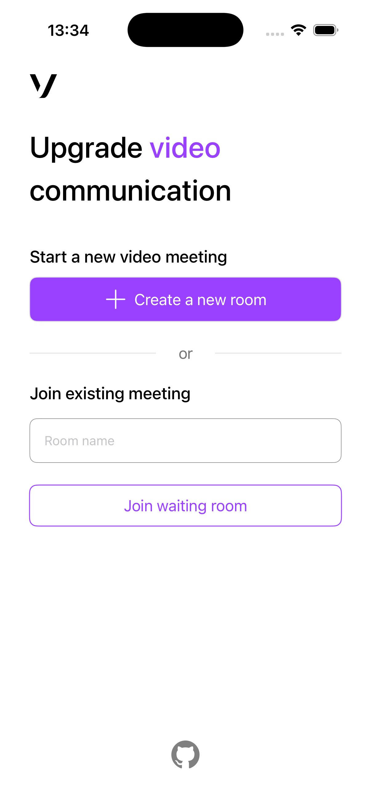
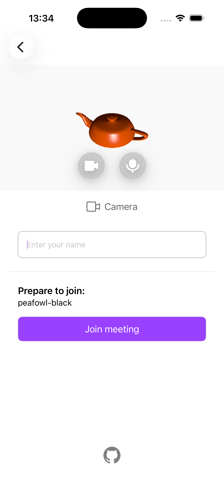
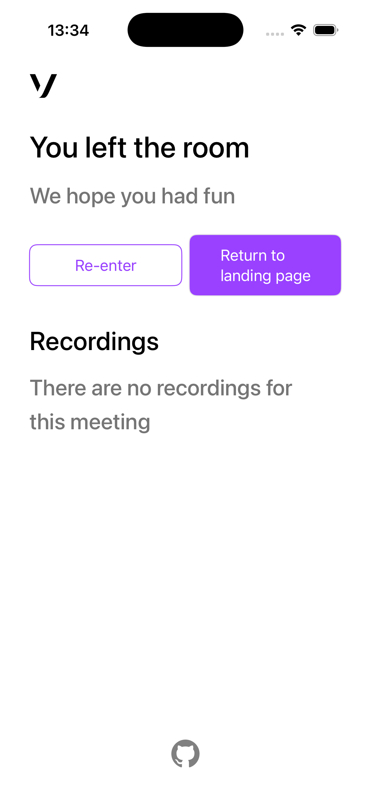
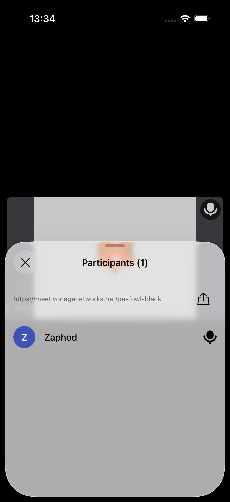
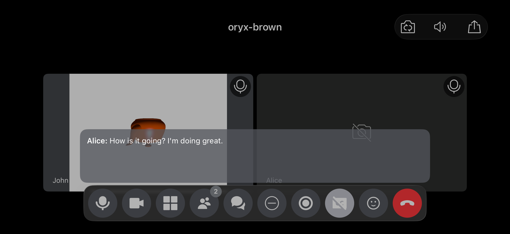
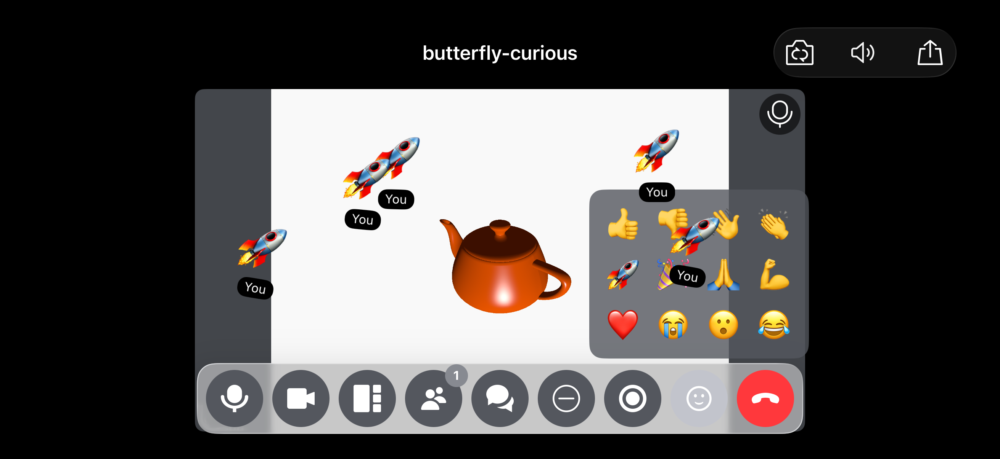

# Vonage Video API Reference App for iOS

## Welcome to Vonage

If you're new to Vonage, you can [sign up for a Vonage API account](https://dashboard.nexmo.com/sign-up?utm_source=DEV_REL&utm_medium=github&utm_campaign=vonage-video-ios-app) and get some free credit to get you started.

## What is it?

The Vonage Video API Reference App for iOS is an open-source video conferencing reference application built with the [Vonage Video API](https://developer.vonage.com/en/video/client-sdks/web/overview) and iOS SDK. It demonstrates best practices for integrating the Vonage Video API for use cases ranging from one-to-one calls to multi-participant conferencing with CallKit, screen sharing, captions, and more.

## Cross-Platform Support

The reference app is also available for:

- **Web (React)**: [vonage-video-react-app](https://github.com/Vonage/vonage-video-react-app)
- **Android**: [vonage-video-android-app](https://github.com/Vonage/vonage-video-android-app)

All three share the same backend infrastructure and demonstrate consistent best practices across platforms.

## Why use it?

- **Fast start** — deploy the open-source backend, export a few env vars, and run `tuist generate`.
- **Extensible** — fork and extend for your use case; every feature follows the same Clean Architecture patterns.
- **Secure by design** — open-source transparency with a production-grade information security architecture.
- **Cross-platform consistency** — iOS, Android, and Web apps share the same backend and API contracts.

## Features

| Feature | Preview |
|---|---|
| Landing page — create and join rooms |  |
| Waiting room — preview A/V settings and set display name |  |
| Post-call page — re-join or download archives |  |
| Participant list with audio indicator |  |
| Live captions |  |
| Emoji reactions |  |
| Configurable feature flags |  |

Additional capabilities: up to 25 participants · active speaker detection · cloud recording · background blur · ShareLink · grid / active-speaker layouts · CallKit · ReplayKit screen sharing · advanced noise suppression.

## Platforms & Requirements

| Requirement | Version |
|---|---|
| iOS deployment target | 16.0+ |
| Xcode | 26 |
| Tuist | latest |
| SwiftLint | latest |
| SwiftFormat (swift-format) | latest |
| Git LFS | any |
| Java | 17 (Maestro E2E only) |

Core framework modules also target **macOS 14.6+** to enable fast unit-test runs without a simulator.

This app has been tested with **Vonage Video SDK 2.32** and **2.33**. Use the latest available SDK version where possible.

## Documentation

| Guide | Description |
|---|---|
| [Getting Started](docs/GETTING_STARTED.md) | Prerequisites, environment setup, and first run |
| [Architecture](docs/ARCHITECTURE.md) | Module graph, Clean Architecture layers, DI, and key patterns |
| [Configuration](docs/CONFIGURATION.md) | Feature flags, theme tokens, signing, and SDK version |
| [Testing](docs/TESTING.md) | Unit, snapshot, and Maestro E2E tests |
| [Localization](docs/LOCALIZATION.md) | Adding languages and working with String Catalogs |
| [Code Style](docs/CODE_STYLE.md) | SwiftLint, swift-format, and style guidelines |
| [Contributing](docs/CONTRIBUTING.md) | How to open issues, submit PRs, and branching conventions |
| [Known Issues](docs/KNOWN_ISSUES.md) | Current known issues and workarounds |

## Contributing

Read [docs/CONTRIBUTING.md](docs/CONTRIBUTING.md) before opening a pull request. In short: open an issue first for anything beyond a minor bug fix, keep PRs small and focused, and ensure CI passes.

Please also read our [Code of Conduct](CODE_OF_CONDUCT.md).

## Getting Help

- Open an issue on this repository
- Tweet at us: [@VonageDev on Twitter](https://twitter.com/VonageDev)
- [Join the Vonage Developer Community Slack](https://developer.vonage.com/community/slack)
- Email support: [support@api.vonage.com](mailto:support@api.vonage.com)

## Further Reading

- Developer documentation: <https://developer.vonage.com>
